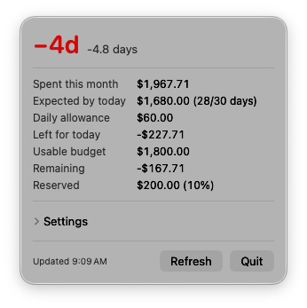

# ClaudePace

macOS menu bar app that shows how many days ahead (`+2d`) or behind (`−1d`) you are on your monthly Claude budget.



## How it works

- Reads Claude Code's session logs (`~/.claude/projects/**/*.jsonl`, `~/.config/claude/projects`, or `$CLAUDE_CONFIG_DIR`) and prices each response's tokens, the same way ccusage does. No API key needed.
- Prices come from LiteLLM's public price list (refreshed daily, cached in `~/Library/Caches/dev.meain.claudepace`), with a built-in table as fallback.
- Claude Code logs a response several times while streaming; the costliest copy per `message.id` + `requestId` is counted.
- Usable budget = budget × (1 − reserve%). Daily allowance = usable ÷ days in month.
- Expected spend = daily allowance × completed days (day 3 → 2 days).
- Label = (expected − spent) ÷ daily allowance, truncated toward zero.
- Months follow your local time zone. Refreshes every 5 minutes; unchanged log files aren't re-parsed.

Only covers Claude Code on this machine, at list prices.

## Build

```sh
./build.sh                                          # → build/ClaudePace.app
open build/ClaudePace.app
swift run --build-system native BudgetChecks        # budget math checks
swift run --build-system native BudgetChecks --scan # this month's spend by model
```

Builds with Command Line Tools only (no Xcode), which is why it uses `--build-system native` and avoids SwiftUI macros like `@State`.
